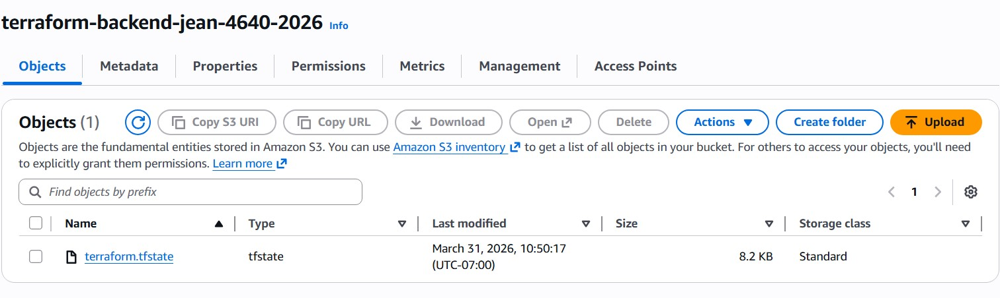
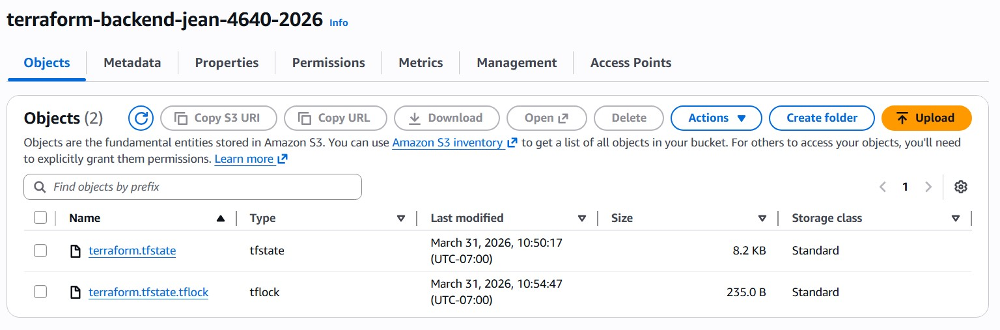

# terraform-s3-backend-lab

See lab instructions on D2L.

## Questions

### When is the state file created?
The state file is created when Terraform writes infrastructure state to the configured remote backend, such as after a successful apply.

### When is the lock file present?
The lock file is present while Terraform is actively running an operation that locks the state, such as apply or destroy.

### Is the lock file always in the bucket after it is created?
No. The lock file is temporary and is removed when Terraform finishes the operation.

## State file only

## State file and lock file

